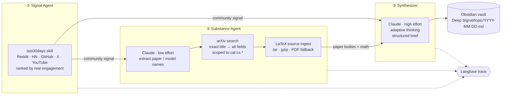

# Deep Signal — Multi-Agent Research Pipeline


**Every morning at 8 AM, three agents find what AI builders are actually talking about, pull the real research papers behind the buzz (down to the raw LaTeX math), and write a plain-English intelligence brief straight into your Obsidian vault. Every step, every token, and every cent is traced in Langfuse.**

Most AI news tools summarize blog posts about papers. Deep Signal goes the other way: it starts from community engagement (Reddit, Hacker News, GitHub, X, YouTube), links the hype to its source on arXiv, and reads the paper itself.

---

## Architecture



| Stage | Input | Output | Smart part |
|---|---|---|---|
| **① Signal** | a topic, e.g. `"Physical AI"` | what the community is discussing this month | ranked by upvotes, stars and engagement, not by SEO |
| **② Substance** | the signal | up to 3 papers with their **full LaTeX bodies** | links casual mentions ("RT-2 is wild") to the exact arXiv paper |
| **③ Synthesizer** | signal + papers | a Markdown brief with frontmatter | explains every formula in one plain sentence |

---

## Under the Hood

### 1. Entity linking: from a Reddit thread to the exact paper

People don't cite papers; they say *"RT-2"* or *"that new VLA model"*. Agent 2 closes that gap:

1. **Extraction:** Claude runs at **low effort** (cheap and fast) and returns a JSON array of paper and model names.
2. **Hardened parsing:** a `json.JSONDecoder.raw_decode` scanner pulls the first valid array out of free-form text. Brackets *inside* names (`"RT-2 [v2]"`) don't break it, and results are de-duplicated and capped.
3. **Two-pass arXiv resolution:** first an exact title phrase match (`ti:"…"`, top hit only, since a named paper is one paper), then an all-fields fallback.
4. **Domain disambiguation:** every query is ANDed with `cat:cs.*`. Without it, *"RT-2"* resolves to a **2010 astrophysics instrument paper**; with it, to *RT-2: Vision-Language-Action Models* (2307.15818). This was verified against the live arXiv API.

If nothing can be linked, the agent falls back to searching the topic itself, so a brief is never empty for lack of names.

### 2. LaTeX ingestion: feeding the model the math, not the boilerplate

PDFs flatten equations into garbage, so Deep Signal downloads the paper's **original LaTeX source**. Making that work took real engineering:

- **Format sniffing:** arXiv serves a gzipped tarball, a gzipped single `.tex`, or just a PDF. All three are detected, and anything unusable falls back to PyMuPDF text extraction.
- **Root-document detection:** the main file is the one declaring `\documentclass`, not simply the largest file (big appendices used to win).
- **Recursive `\input` / `\include` inlining:** many papers keep each section in its own file, so the main `.tex` alone is just front matter. Includes are resolved from the archive (depth-limited to 5). Commented-out includes are ignored because comments are stripped *first*.
- **Token-budget hygiene:** the preamble (`\usepackage…`), comments (while keeping escaped `\%`) and bibliography are removed, so the 20K-character budget per paper goes on content.

**Measured on *Attention Is All You Need*:** the old pipeline sent the model **3K characters of license boilerplate**. Now it sends **20K characters of the actual paper, equations included.**

### 3. Claude integration, built for current models

- **Adaptive thinking aware:** current Claude models put *thinking blocks* before the answer. The pipeline joins only the `text` blocks; the naive `response.content[0].text` crashes on these models.
- **Effort routing:** `low` for the cheap extraction step and `high` for the brief, so you pay for reasoning only where it matters.
- **Server-side refusal fallbacks:** if a safety classifier wrongly declines a request, the API re-runs it on a fallback model *inside the same call* instead of losing the topic.
- **Stop-reason handling:** a `refusal` raises a typed error, and `max_tokens` truncation is logged and flagged in the trace.
- Swap models with one env var (`ANTHROPIC_MODEL`).

### 4. Observability with Langfuse: see every step, token and cent

Every run becomes a **Langfuse trace**, built on OpenTelemetry. One trace per topic:

```
deep_signal | Physical AI                      ← trace: note path, papers found
├── signal_agent                               ← span: signal preview, or the failure reason
├── arxiv_agent                                ← span: entities extracted, papers found
│   └── extract_entities      🤖 generation    ← model · prompt · reply · tokens · $ cost
└── synthesizer                                ← span: paper count, signal length
    └── write_brief           🤖 generation    ← model · prompt · brief · tokens · $ cost
```

What makes it more than "logging with a UI":

- **LLM calls are first-class *generations*,** not log lines. Each records the model, full prompt (system and user), full reply, `effort` / `max_tokens` settings, input/output token counts and **USD cost**.
- **Cost is computed client-side** from Anthropic list prices and attached to every generation. The dashboard shows cost per call, per topic and per day, even for models too new for Langfuse's own price table.
- **The model that actually answered is recorded.** If a refusal fallback kicks in, the generation shows the fallback model, not the requested one.
- **Problems are color-coded:** API errors are `ERROR`, while refusals and truncation are `WARNING`. You can filter straight to bad runs.
- **Zero overhead when off:** no keys means no tracing, no noise and no crashes. Decorators run at import time, before `.env` is loaded, so `core/tracing.py` decides traced-vs-plain *per call* instead of at decoration time.
- **Debuggable by design:** when a brief looks wrong, the trace shows whether the signal was empty, whether entity linking missed, or what exact prompt the synthesizer saw.

This was verified by running the full pipeline with the real Langfuse client and an in-memory OpenTelemetry exporter. That confirmed the trace name, the generation types, the parent/child nesting, and the cost math (20K in + 3K out on Opus 5.5 = $0.14).

### 5. Production-grade reliability for a cron job

| Failure mode | Behavior |
|---|---|
| One topic crashes | Logged with a traceback; **the other topics still run** |
| Any topic failed | Process exits with **code 1**, so Task Scheduler's *Last Run Result* shows it |
| Windows log redirection (cp1252) | stdout is forced to UTF-8, so Unicode output can't crash the run |
| Vault path typo / OneDrive not mounted | **Fails fast** before spending API calls, never creates a phantom vault |
| Missing API key | Clear error at startup |
| Signal skill missing or timed out | Agent 2 falls back to topic search; reason recorded in the trace |
| Repo moved | Scheduler scripts resolve paths relative to themselves and prefer `.venv` |

---

## The Brief

Each note lands at `Deep Signal/<topic>/YYYY-MM-DD.md`, with YAML frontmatter (date, topic, tags) for Obsidian search and Dataview:

- **TL;DR:** 2–3 sentences, readable in 10 seconds
- **What the Community is Saying:** why developers care, with an Obsidian callout
- **The Papers:** each paper in plain English, why it matters, and the key idea, with `[[wikilinks]]`
- **Key Formulas:** the LaTeX equations, each with a one-sentence plain-English explanation
- **What to Watch Next:** specific projects, researchers and deadlines for the next two weeks

---

## Quickstart

### 1. Install

```bash
python -m venv .venv
.venv\Scripts\activate          # macOS/Linux: source .venv/bin/activate
pip install -r requirements.txt
```

### 2. Clone the signal skill

```bash
cd skills
git clone https://github.com/mvanhorn/last30days-skill last30days
cd last30days && uv sync && cd ../..
```

> Requires Python 3.12+ and [uv](https://github.com/astral-sh/uv).

### 3. Add keys

```bash
cp .env.example .env
```

| Variable | Required | Where to get it |
|---|---|---|
| `ANTHROPIC_API_KEY` | ✅ | [console.anthropic.com](https://console.anthropic.com). API billing is separate from a Claude.ai subscription |
| `ANTHROPIC_MODEL` | — | defaults to `claude-opus-5-5`; `claude-sonnet-5-5` costs about half |
| `LANGFUSE_PUBLIC_KEY` / `LANGFUSE_SECRET_KEY` | — | free at [cloud.langfuse.com](https://cloud.langfuse.com) → Settings → API Keys |
| `XAI_API_KEY`, `GOOGLE_API_KEY`, `BRAVE_API_KEY` | — | unlock X, YouTube and web search in the signal stage |

### 4. Point it at your vault

```yaml
# config.yaml
vault_path: "C:/path/to/your/Obsidian/vault"
scheduled_topics:
  - "Physical AI"
  - "Embodied AI robotics"
  - "Vision Language Action models"
```

### 5. Run

```bash
python pipeline.py "Physical AI"          # on demand, any topic
python pipeline.py                        # all scheduled_topics
scheduler\register.bat                    # daily at 8 AM (Windows, run as admin)
```

Logs go to `logs/pipeline.log`. Check the task with `schtasks /query /tn "DeepSignalPipeline"`.

---

## Configuration

| Key | Default | What it does |
|---|---|---|
| `max_papers` | `3` | Papers fetched per topic |
| `arxiv_category_filter` | `cat:cs.*` | Scopes paper search to computer science; `""` disables it |
| `paper_char_budget` | `20000` | Characters of each paper body sent to the synthesizer |
| `signal_char_budget` | `12000` | Characters of community signal sent to the synthesizer |
| `signal_timeout_sec` | `90` | Timeout for the signal stage |

## Cost

These are estimates; Langfuse shows your real numbers after the first run. A topic sends about 20K input tokens and gets a few thousand output tokens back.

| Model | Per topic | 3 topics/day, per month |
|---|---|---|
| `claude-opus-5-5` (default) | ~$0.15–0.25 | ~$15–20 |
| `claude-sonnet-5-5` | ~$0.08–0.12 | ~$7–10 |

Set a monthly spend limit in the Anthropic Console for peace of mind.

---

## Project Structure

```
pipeline.py            orchestrator: per-topic isolation, exit codes, trace naming
agents/
  signal_agent.py      ① runs last30days in its own venv, with a timeout
  arxiv_agent.py       ② entity linking, arXiv resolution, LaTeX ingestion
  synthesizer.py       ③ prompt assembly and brief generation
core/
  llm.py               Claude client, effort, fallbacks, stop reasons, cost
  tracing.py           Langfuse spans + generations, no-op when disabled
  obsidian.py          slugging, frontmatter, note writing
  config.py            .env + config.yaml loading, vault guard
scheduler/             Windows Task Scheduler scripts (path-independent)
tests/                 18 offline tests, no network or API spend
```

## Tests

```bash
pip install -r requirements-dev.txt
pytest
```

The 18 tests cover LaTeX extraction (tarballs, single files, `\input` inlining, PDFs), entity parsing edge cases, thinking-block handling, refusals, per-model request parameters, cost math, Langfuse generation recording, note writing and failure isolation. They make no network calls and spend nothing on the API.

## Stack

| Layer | Tool |
|---|---|
| Signal discovery | [mvanhorn/last30days-skill](https://github.com/mvanhorn/last30days-skill) |
| Papers | arXiv API + LaTeX source, PyMuPDF fallback |
| LLM | Claude (Anthropic API), adaptive thinking + effort control |
| Observability | [Langfuse](https://langfuse.com) v4 (OpenTelemetry) |
| Output | Obsidian vault (Markdown + YAML frontmatter) |
| Scheduling | Windows Task Scheduler |
